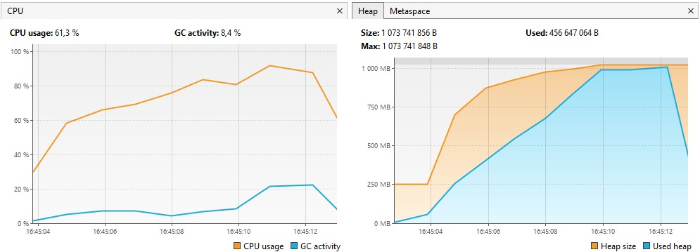
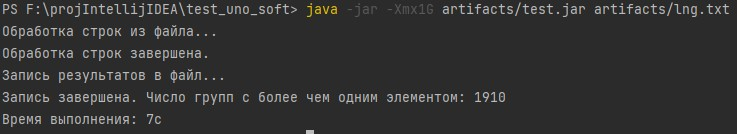

## Результаты выполнения [тестового задания](https://github.com/PeacockTeam/new-job/blob/27d105519e40eeb0c295e05f28f227d0b27ac903/lng%26java#L56C1-L56C1)

- Число групп с более чем одним элементом: **1910**;
- Время выполнения: **7 секунд**.  

Скриншоты из VisualVM и терминала:

После выполнения программы в папке с .jar и .txt файлами (test_uno_soft/artifacts) появится результирующий файл `result.txt`

## Сборка и запуск

- `mvn clean package`  
- `java -jar -Xmx1G artifacts/test.jar artifacts/lng-big.csv`